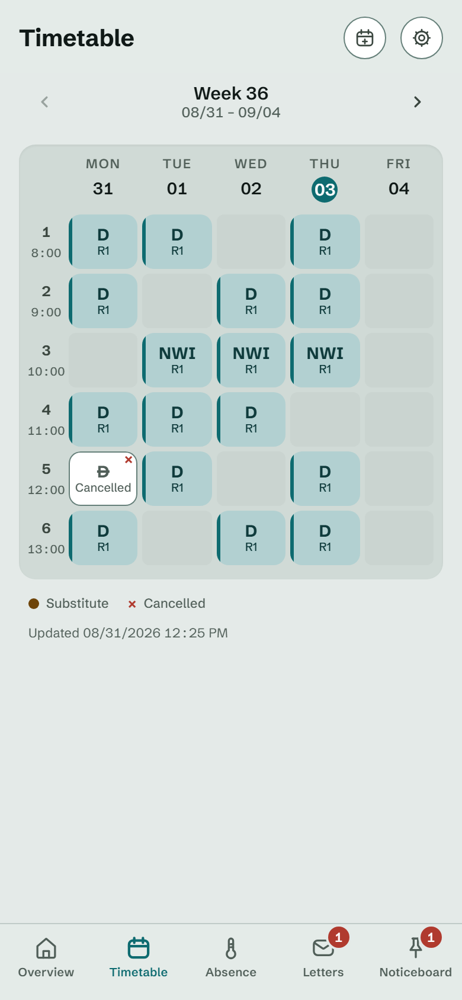
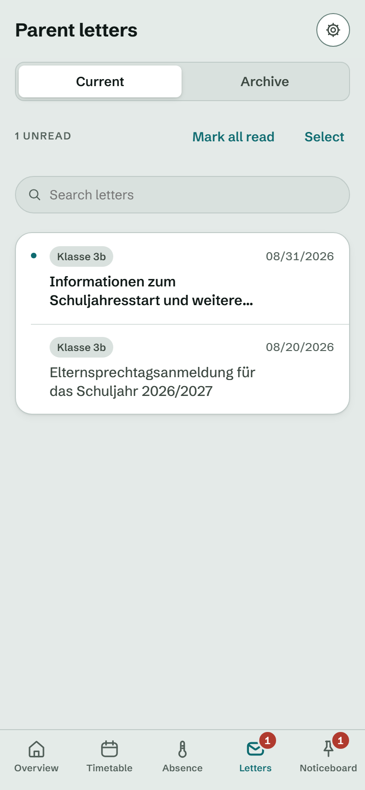
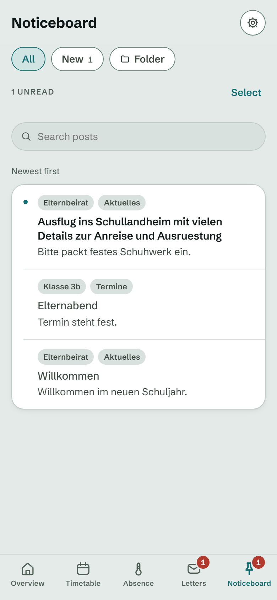
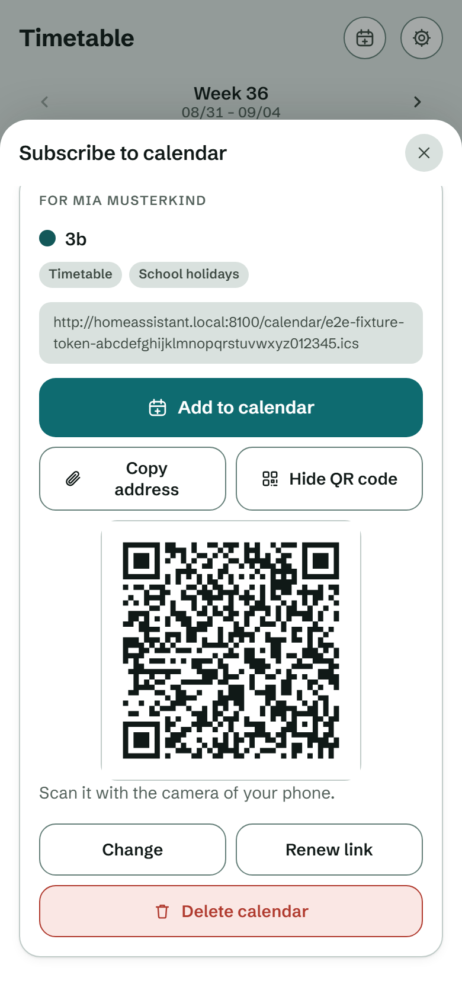
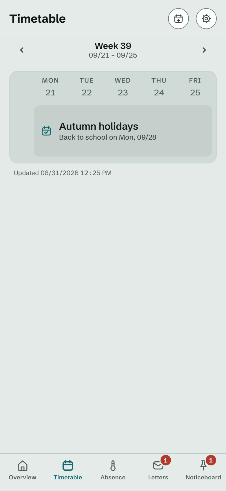
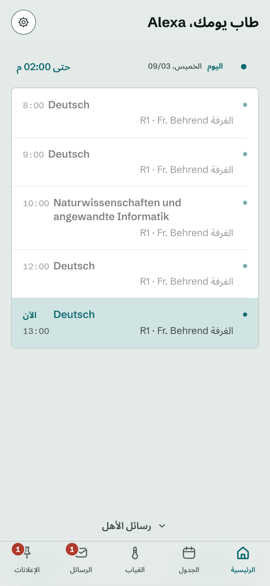
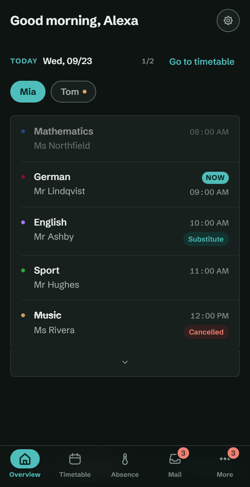
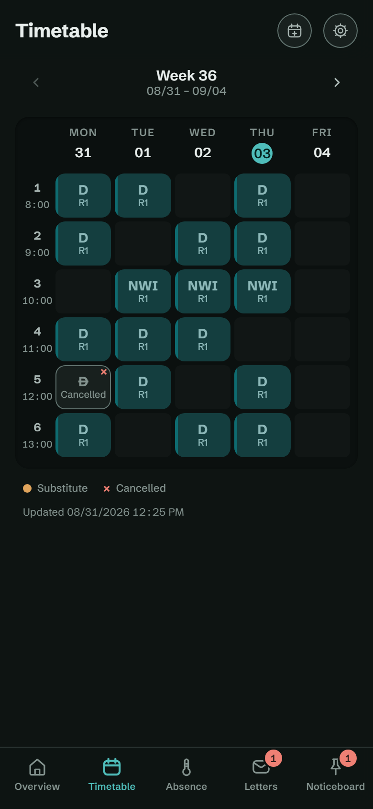

# Ranzenpost — an unofficial IServ client for parents

A [Home Assistant](https://www.home-assistant.io) add-on that signs in with your own parent
account on an [IServ](https://iserv.de) school server and puts the parts parents actually use —
timetable, parent letters, noticeboards and absences — into one mobile-first UI.

It reads *and* writes: report a sick note, archive a letter, mark a test, or subscribe your phone's
calendar app to your child's lessons, without opening the IServ website. Everything runs on your own
Home Assistant instance; there is no service of ours in between.

Not affiliated with IServ GmbH.

## Install

1. Click the button above — Home Assistant opens and asks you to confirm the repository. Or add it
   by hand: **Settings → Add-ons → Add-on Store → ⋮ → Repositories** and paste
   `https://github.com/githuber110/ranzenpost`.
2. **Ranzenpost (IServ)** now appears in the store. Open it, click **Install**, then **Start**.
3. Open **Ranzenpost** from the Home Assistant sidebar. The setup wizard asks for your school's
   address, your parent login and — if your school uses it — one code from your authenticator app.
   No YAML, no tokens to copy by hand.

**Requirements:** Home Assistant OS or Supervised (the add-on store needs the Supervisor) on
`amd64` or `aarch64`, and an IServ parent account at a school that has the parent modules enabled.

**Updating:** new versions show up under **Settings → Add-ons → Ranzenpost (IServ)** like any other
add-on. Settings and the school connection survive an update.

[`iserv_connector/DOCS.md`](iserv_connector/DOCS.md) is the documentation shown inside Home
Assistant and goes into more detail on options, notifications and MQTT.

## Contents

- [Install](#install)
- [Why Ranzenpost](#why-ranzenpost)
- [Screens](#screens)
- [Features](#features)
  - [Timetable](#timetable)
  - [Absences — view and report](#absences--view-and-report)
  - [Letters and noticeboards](#letters-and-noticeboards)
  - [Overview](#overview)
  - [Calendar subscription](#calendar-subscription)
  - [Notifications](#notifications)
  - [Setup, languages, themes](#setup-languages-themes)
- [Calendar port](#calendar-port)
- [Privacy](#privacy)
- [Getting help](#getting-help)
- [Contributing](#contributing)
- [License](#license)
- [Support the project](#support-the-project)

## Why Ranzenpost

- **One app, not a website in a frame.** A UI built for a phone in a parent's hand: today's lessons
  first, four taps for a sick note, swipe to mark a letter read.
- **Reads and writes.** Absences, archiving, read confirmations and exam marks go back to IServ —
  always after an explicit confirmation, never on their own.
- **Your Home Assistant, nobody else's server.** The only outbound connections are your school's
  IServ and a public-holiday API that learns nothing but a federal state and a year.
- **Six languages, right-to-left included.** German, English, Arabic, Turkish, Russian, Ukrainian.
- **Made for families.** Several children per account, a calendar feed per child, push messages
  for every timetable change, and school holidays for all 16 federal states.
- **Tested against a fixture server.** Backend, frontend and end-to-end suites run in CI on every
  push; the release image is built from a tagged commit whose version is checked against the tag.

## Screens

All data below comes from the test fixture server — **the children, teachers, subjects, letters,
notices and calendar tokens are invented**, not from a real school.

<table>
  <tr>
    <td width="50%" align="center"></td>
    <td width="50%" align="center"></td>
  </tr>
  <tr>
    <td align="center"><b>Today</b> Opens on the current day and marks the running lesson.</td>
    <td align="center"><b>Timetable</b> The week per child. Cancellations and cover lessons are marked, never hidden.</td>
  </tr>
  <tr>
    <td align="center"></td>
    <td align="center"></td>
  </tr>
  <tr>
    <td align="center"><b>Reporting an absence</b> A guided wizard. The last step restates everything before anything is sent.</td>
    <td align="center"><b>Parent letters</b> Current and archived, with a read state the app keeps itself.</td>
  </tr>
  <tr>
    <td align="center"></td>
    <td align="center"></td>
  </tr>
  <tr>
    <td align="center"><b>Noticeboard</b> All boards merged into one newest-first feed, each post badged with its source.</td>
    <td align="center"><b>Calendar subscription</b> A token-protected feed per child, as a link or a QR code.</td>
  </tr>
  <tr>
    <td align="center"></td>
    <td align="center"></td>
  </tr>
  <tr>
    <td align="center"><b>School holidays</b> A full holiday week replaces the grid instead of showing five empty days.</td>
    <td align="center"><b>Six languages</b> Arabic turns the whole layout right-to-left; school content keeps its own direction.</td>
  </tr>
  <tr>
    <td align="center"></td>
    <td align="center"></td>
  </tr>
  <tr>
    <td align="center"><b>Dark theme</b> Follows the device, or is pinned in Settings.</td>
    <td align="center"><b>Dark theme, timetable</b> Text contrast is checked against WCAG in both themes.</td>
  </tr>
</table>

## Features

### Timetable

- The week per child, with substitutions and cancellations marked rather than dropped.
- Week navigation; lesson times are read from IServ, not guessed.
- Subject and teacher display names, subject colours (14-colour palette) and lesson times are all
  editable; unknown subject codes are picked up automatically.
- **Exam marks:** tap a lesson to mark it as a test with a free-form name. Marks show up in the grid
  and in the today view. If the marked lesson is later cancelled, moved or covered, a clarification
  panel asks what should happen instead of guessing.
- **Holidays** for all 16 German federal states, with a suggestion derived from the school's postal
  code where one is available. A full holiday week replaces the grid; single free days are shown by
  name. Lessons are only ever overridden when the source proves the day is school-free.

### Absences — view and report

- All four IServ types: sick note, leave request, deregistration (bus, lunch, kindergarten) and
  day-care deregistration.
- A step-by-step wizard: four taps for the common sick note, no scrolling on any step, and a review
  step that restates the whole report before it goes out.
- Your school's own rules are honoured — cut-off time for same-day sick notes, minimum notice for
  leave requests, whether comments or reasons are mandatory, whether single lessons can be reported.
- Notifiable-illness hint, and the school's phone numbers one tap away.
- Leave requests can carry attachments, with a per-file and a total limit enforced in the UI *and*
  on the server.
- A sick note can be saved or printed as a confirmation PDF.
- Every write action to IServ needs an explicit confirmation. Nothing is sent on your behalf.

### Letters and noticeboards

- Parent letters, current and archived, with attachments and archiving. IServ exposes no per-letter
  read state, so the app keeps its own — including swipe to mark read.
- Noticeboards merged into one newest-first feed with a source badge per post, jump navigation into
  a single board with its swimlanes, full-text search, attachments and an app-side read state.
- Parent-teacher conference days.

### Overview

- Four fixed chapters — today, letters, noticeboard, what is coming up — as snapping pages, with a
  pill per child and an anchor on the current lesson.
- At large system font sizes the paging switches itself off and the overview scrolls freely, so
  nothing is ever cut off.

### Calendar subscription

- A feed per child that your calendar app subscribes to: lessons, school holidays, public holidays,
  exam marks and approved absences, each switchable.
- Link or QR code; the token can be rotated or the subscription deleted at any time.
- Cancelled lessons stay in the feed and are labelled as cancelled — they are never silently removed.
- The child's name appears neither in the feed nor in its address; the subscription is labelled with
  the class by default.
- Served on a **separate port that is switched off out of the box** — see [Calendar port](#calendar-port).

### Notifications

- A push message for every timetable change, to a Home Assistant notify service of your choice.
  Targets are grouped by category with readable device names and a per-target test button.
- Notification texts are localised into all six languages, with correct plural forms.
- Optionally, MQTT discovery sensors per child for dashboards outside this app (experimental,
  off unless you fill in an MQTT host).

### Setup, languages, themes

- A guided wizard: school address, parent login, two-factor, child selection, school phone numbers.
  If your school uses two-factor authentication you type **one** current code from the authenticator
  app you already use; Ranzenpost registers its own token invisibly and your existing app keeps
  working. Every step has *Back* and *Start over*.
- The app re-checks its access on every launch and offers to set up again if it was revoked in IServ.
- Six languages: German, English, Arabic (right-to-left), Turkish, Russian and Ukrainian. Dates,
  times and numbers follow the active language; the school timezone stays Europe/Berlin.
- Light and dark themes, with text contrast checked against WCAG in both.
- Settings writes are atomic; a file that was corrupted by a power cut is quarantined instead of
  taking your configuration down with it.

## Calendar port

Calendar feeds are served on a second port (8100) so calendar apps can reach them directly, separate
from the Ingress UI. It is **off by default**. To switch it on: Home Assistant →
**Settings → Add-ons → Ranzenpost (IServ) → Configuration → Network**, enable *Show disabled ports*,
map port 8100, save and restart the add-on.

Two things worth knowing before you do:

- A subscription link shows that child's timetable to anyone who has it, with no password prompt.
  Treat the link itself as the secret; rotate or revoke it in Settings if it leaks.
- Nabu Casa remote access does **not** forward add-on ports. Reaching port 8100 from outside your
  home network needs your own remote access or a VPN. Short-notice changes still reach you away from
  home through the app's push messages.

## Privacy

- Everything runs on your Home Assistant. There is no account with us, and no server of ours.
- Two outbound destinations: your school's IServ, and `openholidaysapi.org` for holiday dates. The
  holiday request sends nothing but a federal state and a year.
- Your school URL, login and the app's own two-factor key stay in the add-on's `/data`. Login and
  two-factor key are encrypted at rest (Fernet). Set a **passphrase** in the add-on options and the
  encryption key is derived from it at runtime (scrypt) and never written to disk — only a salt is
  stored, so a copy of `/data` alone can no longer be decrypted. A *full* Home Assistant backup also
  contains the add-on options, so treat full backups as trusted either way.
- Only your own authorized children are read. The app never probes other child IDs.
- **Disconnect** (Settings) tries to remove the app's two-factor token from IServ, then deletes the
  school URL, children, phone numbers and secrets locally, leaving you back at the setup wizard.
- The repository itself contains no personal data.

## Getting help

- Something looks wrong? Check the add-on log first: **Settings → Add-ons → Ranzenpost (IServ) →
  Log**.
- Then open an [issue](https://github.com/githuber110/ranzenpost/issues) with the add-on version
  (shown on that same page) and the relevant log lines. Names of children, teachers and your school
  may appear in the log — please strip them before pasting.
- Found a security problem? Do not open a public issue — see [SECURITY.md](SECURITY.md).

## Contributing

Bug reports, translations and pull requests are welcome. The development setup, the test suites
and the code conventions (English identifiers, no comments, every user-visible string in
`frontend/i18n/`) are in [CONTRIBUTING.md](CONTRIBUTING.md).

## License

MIT — see [LICENSE](LICENSE).

The MIT license covers only the code. The bundled fonts are licensed under the
[SIL Open Font License 1.1](frontend/fonts/OFL.txt):

- `archivo-600-700.woff2` — **Archivo**, © The Archivo Project Authors
  ([github.com/Omnibus-Type/Archivo](https://github.com/Omnibus-Type/Archivo)).
- `schibsted-grotesk-400-700.woff2` — **Schibsted Grotesk**, © Schibsted Media
  ([github.com/schibsted/schibsted-grotesk](https://github.com/schibsted/schibsted-grotesk)).
- `inter-cyrillic-400-700.woff2` — **Inter**, © The Inter Project Authors
  ([github.com/rsms/inter](https://github.com/rsms/inter)),
  [licence](frontend/fonts/OFL-Inter.txt).
- `noto-sans-arabic-400-700.woff2` — **Noto Sans Arabic**, © The Noto Project Authors
  ([github.com/notofonts/arabic](https://github.com/notofonts/arabic)),
  [licence](frontend/fonts/OFL-NotoSansArabic.txt).

All four live in `frontend/fonts/`.

## Support the project

Ranzenpost is built in the evenings by one parent, for free, and stays that way. If it saves you a
few trips to the IServ website and you feel like saying thanks:

