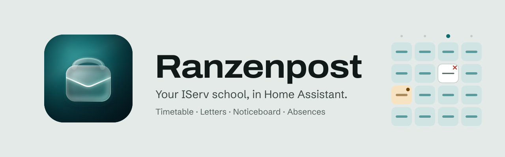
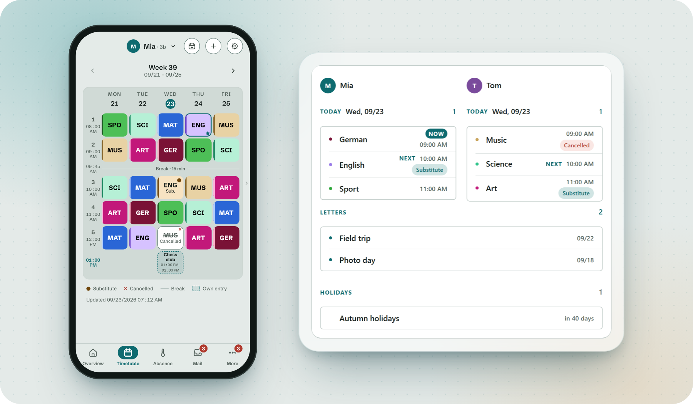
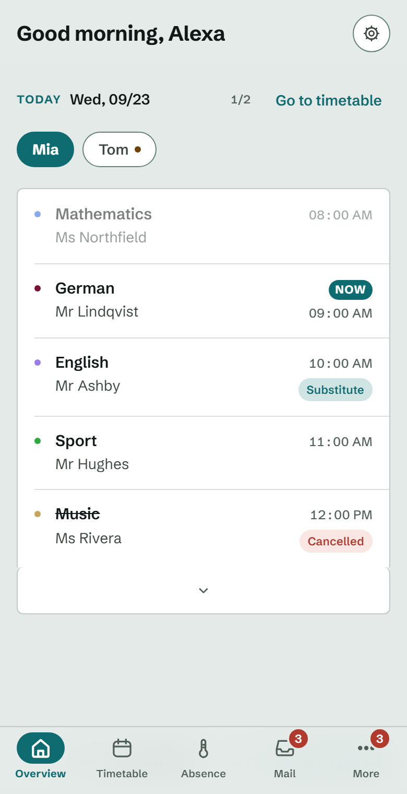
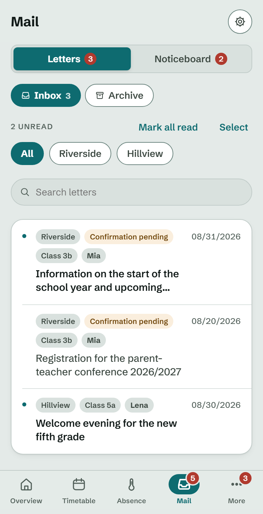
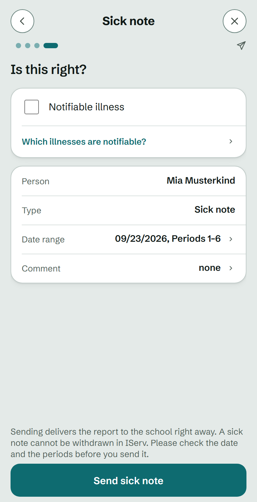
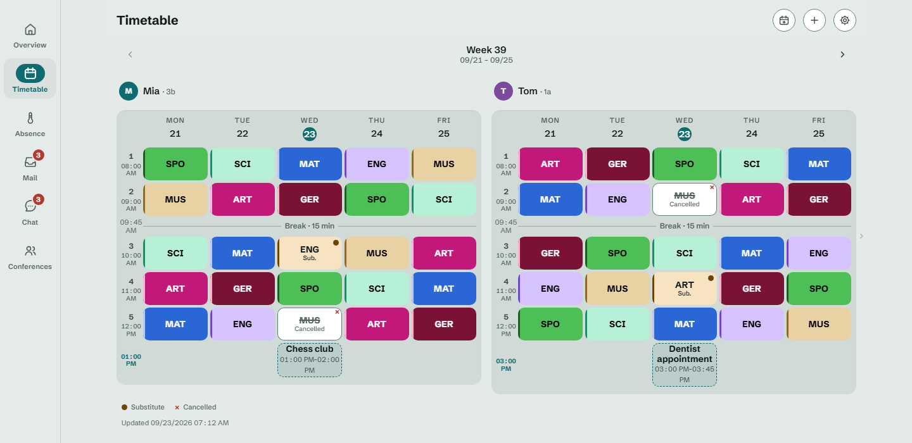

[English](README.md) | [Deutsch](README.de.md)

<p align="center">
  <picture>
    <source media="(prefers-color-scheme: dark)" srcset="assets/banner-dark.svg">
    
  </picture>
</p>

<p align="center"><b>Your children's school day in Home Assistant.</b><br>Timetable, substitutions, parent letters, the noticeboard and sick notes from your school's <a href="https://iserv.de">IServ</a>, as an app in the sidebar, a dashboard card and entities for your automations.</p>

<p align="center">
  <a href="https://github.com/githuber110/ranzenpost/actions/workflows/build.yml"></a>
  <a href="https://github.com/githuber110/ranzenpost/releases"></a>
  <a href="https://www.home-assistant.io"></a>
  <a href="https://hacs.xyz"></a>
  <a href="LICENSE"></a>
</p>

<p align="center">
  <picture>
    <source media="(prefers-color-scheme: dark)" srcset="docs/screenshots/hero-dark.png">
    
  </picture>
</p>

<p align="center"><sub>Every screenshot comes from the test fixture server. Children, teachers, schools and letters are invented.</sub></p>

<table>
  <tr>
    <td width="33%" valign="top"><b>A card for every dashboard</b><br>Today, the next lesson, the week, letters, holidays and more. Pick the blocks, the size and the children in the visual editor.</td>
    <td width="33%" valign="top"><b>Every child is a device</b><br>Calendars, sensors and an event per child: the next lesson, the end of school, the next exam, unread letters, open absences.</td>
    <td width="33%" valign="top"><b>Automations without YAML</b><br>Device triggers such as "lesson cancelled" or "new letter" and conditions such as "is a school day", right in the automation editor.</td>
  </tr>
  <tr>
    <td valign="top"><b>Sick notes in a few steps</b><br>Report an absence the way your school wants it, with a review step before anything is sent.</td>
    <td valign="top"><b>Several schools, one app</b><br>Two children at two schools, or two accounts. One feed, one overview, each school on its own login.</td>
    <td valign="top"><b>Stays at home</b><br>Runs on your Home Assistant. No cloud, no account, no server in between. Logins are encrypted at rest.</td>
  </tr>
</table>

> [!NOTE]
> Ranzenpost is a hobby project by one parent and not affiliated with IServ GmbH. It started with one parent account at one school and reads the IServ modules listed further down. If your school runs a module that is missing, the settings page opens a prefilled issue for it.

## Install

You want both parts. The add-on signs in to IServ and serves the app in the sidebar. The integration turns the same data into entities and the dashboard card.

### 1. Add the repository

[](https://my.home-assistant.io/redirect/supervisor_add_addon_repository/?repository_url=https%3A%2F%2Fgithub.com%2Fgithuber110%2Franzenpost)

Home Assistant opens and asks you to confirm the repository.

### 2. Install the add-on and run the setup

**Ranzenpost (IServ)** now appears in the add-on store. Open it, click **Install**, then **Start**. Open **Ranzenpost** from the sidebar. The setup asks for your school's address, your parent login and, if your school uses it, one code from the authenticator app you already have. Your authenticator keeps working. Then pick your children. Done.

### 3. Add the integration

[](https://my.home-assistant.io/redirect/hacs_repository/?owner=githuber110&repository=ranzenpost&category=integration)

Install **Ranzenpost** in HACS and restart Home Assistant. Then go to **Settings, Devices & services, Add integration** and search for **Ranzenpost**. The running add-on is found on its own. If you start with the integration instead, it offers to install the add-on for you.

### Requirements

- Home Assistant 2025.6 or newer, as Home Assistant OS or Supervised. The add-on store needs the Supervisor.
- A machine with `amd64` or `aarch64`, for example a Raspberry Pi 4 or 5, a Home Assistant Green or Yellow, or an x86 box.
- An IServ parent account at a school that has switched on the parent modules.
- Two-factor login is what Ranzenpost was built and tested with. A login without two-factor is built in but has not been verified at a real school yet.
- HACS for the integration.

<details>
<summary>Install by hand, update, and Home Assistant without a Supervisor</summary>

**Add-on by hand:** **Settings, Add-ons, Add-on Store**, the menu in the top right, **Repositories**, paste `https://github.com/githuber110/ranzenpost`.

**Integration by hand:** **HACS**, the menu in the top right, **Custom repositories**, paste `https://github.com/githuber110/ranzenpost`, pick **Integration**.

**Without a Supervisor:** the integration asks for the add-on's host, port and token. The token is in the app under **Settings, Home Assistant**, with a copy button.

**Updating:** the add-on updates under **Settings, Add-ons, Ranzenpost (IServ)**, the integration under HACS. Install the add-on and the integration of the same release, then restart Home Assistant and reload the page. A repair tells you when one of them is a release behind. Settings and the school connection survive an update.

The documentation shown inside Home Assistant is [`iserv_connector/DOCS.md`](iserv_connector/DOCS.md).

</details>

## Home Assistant

### Dashboard card

The integration registers `custom:ranzenpost-card`. Add it from the card picker and set it up in the visual editor: a title, the children, the blocks and a size per block. The card follows the dashboard's language and theme. It is built from the same blocks as the app's overview: `today`, `next_lesson`, `week`, `changes`, `letters`, `noticeboard`, `absences`, `conferences` and `holidays`. Only blocks of modules your school has are offered. A block without content is not drawn, and every block opens the app with "Show all". With several children the day blocks sit side by side and the family blocks come once.

```yaml
type: custom:ranzenpost-card
title: School
blocks:
  - key: today
    size: compact
  - letters
  - holidays
children:
  - mia
  - tom
```

<details>
<summary>More card examples</summary>

A wall tablet in the hallway, one child, the week at a glance:

```yaml
type: custom:ranzenpost-card
blocks:
  - next_lesson
  - key: week
    size: compact
children:
  - mia
```

Without day blocks, for a phone dashboard:

```yaml
type: custom:ranzenpost-card
blocks:
  - changes
  - letters
  - absences
  - conferences
```

`children` takes first names, first names with the school in brackets, or the children's keys from the add-on. Leave it out for every child. Each block is a key or a key with a `size`, `compact` or `normal`. The older `view` and `child` keys still work.

</details>

### What each child brings

The integration creates one device per school and one per child. Entity IDs use the first name, for example `sensor.ranzenpost_mia_next_lesson`. When two children at different schools share a first name, the school is added. Entities exist only for the modules your school has.

| Entity | What it holds | Attributes |
| --- | --- | --- |
| `calendar.ranzenpost_mia_lessons` | Lessons, with substitutions and cancellations | The next lesson: `summary`, `start`, `end`, `subject`, `subject_code` |
| `calendar.ranzenpost_mia_exams` | Marked exams | The next exam: `summary`, `start`, `end`, `subject`, `subject_code`, `name` |
| `calendar.ranzenpost_mia_absences` | Approved absences | The next absence: `summary`, `start`, `end`, `kind` |
| `calendar.ranzenpost_mia_own_entries` | Own clubs and appointments, while the school's switch on the lesson times page is on. Breaks never | The next entry: `summary`, `start`, `end`, `kind` |
| `sensor.ranzenpost_mia_current_lesson` | The subject of the lesson running now, `none` outside lessons | `date`, `weekday`, `period`, `subject`, `subject_code`, `teacher`, `room`, `start`, `end`, `substitution`, `cancelled`, `kind`, `before`, `after`, `note`, `minutes_until`, `minutes_left` |
| `sensor.ranzenpost_mia_next_lesson` | The subject of the next lesson, also across the weekend and the holidays | The same fields as the current lesson |
| `sensor.ranzenpost_mia_school_end_today` | When the last lesson ends today, unknown on a free day | `school_day` |
| `sensor.ranzenpost_mia_next_school_day` | When the first lesson of the next school day starts | `date`, `weekday`, `days_until`, `end`, `lessons`, `first_lesson` |
| `sensor.ranzenpost_mia_changes_today` | Number of timetable changes today | `changes`, a list of lessons with the fields above |
| `sensor.ranzenpost_mia_next_exam` | The subject of the next marked exam, `none` without one | `date`, `weekday`, `days_until`, `period`, `subject`, `subject_code`, `name`, `start`, `end`, `teacher`, `room` |
| `sensor.ranzenpost_mia_exams_upcoming` | Number of marked exams in the next 30 days | `exams`, a list with the fields above, and `days` |
| `sensor.ranzenpost_mia_unread_letters` | Number of unread parent letters | `letters`, up to ten with `title`, `sender`, `date`, `child` |
| `sensor.ranzenpost_mia_unread_posts` | Number of unread noticeboard posts | `posts`, up to ten with `title`, `sender`, `date`, `child` |
| `sensor.ranzenpost_mia_open_absences` | Number of absences waiting for a decision | `absences`, each with `kind`, `summary`, `start`, `end`, `status`, `days_until` |
| `sensor.ranzenpost_mia_next_absence` | The date of the next open or upcoming absence, `none` without one | `kind`, `summary`, `start`, `end`, `status`, `days_until` |
| `sensor.ranzenpost_mia_timetable_last_updated` | When the timetable was last updated | `source`: `iserv` for the stamp IServ shows, `app` for the last successful fetch |
| `binary_sensor.ranzenpost_mia_school_day_today` | Whether today is a school day | |
| `binary_sensor.ranzenpost_mia_timetable_changed_today` | Whether today's timetable changed | |
| `event.ranzenpost_mia_timetable_changed` | Fires on a substitution, cancellation, room change or new lesson | `child`, `summary`, `date`, `period` |

Each school adds its own device. With several schools, the school's name joins the ID, for example `sensor.ranzenpost_school_riverside_primary_next_holiday`.

| Entity | What it holds | Attributes |
| --- | --- | --- |
| `calendar.ranzenpost_school_holidays` | School holidays and public holidays | The next holiday: `summary`, `start`, `end` |
| `sensor.ranzenpost_school_next_holiday` | The name of the next holiday | `start`, `end`, `days_until` |
| `sensor.ranzenpost_school_next_conference` | The date of the next parent-teacher conference | `date`, `title`, `details`, `days_until` |
| `sensor.ranzenpost_school_connection` | `ok`, `error`, `unconfigured`, `unreachable` or `auth_failed` | `last_poll`, `last_success`, `version`, `modules`, `modules_disabled`, `feed_port_open`, `ingress_path` |

A counter reads `0` and an empty list when there is nothing, a text sensor reads `none`, and a timestamp sensor stays `unknown` only while no such moment exists. Times are ISO 8601 in the school's time zone, dates are `YYYY-MM-DD`, weekdays are English names such as `monday`. The integration asks the add-on every 60 seconds and never talks to IServ itself. The calendars also show up in Home Assistant's calendar panel.

### Automations

In the automation editor, pick a child's device and choose a trigger: **Timetable changed**, **Lesson cancelled**, **Substitution**, **New letter**, **New noticeboard post** or **Absence status changed**. A school's device offers **School unreachable**, **School reachable again** and **Login needed**. Two conditions check a child: **Is a school day** and **A lesson is running**. No YAML needed.

The sensors carry enough for the rest. Four ideas to copy:

<details>
<summary>Light up the kids' room on school days only</summary>

```yaml
triggers:
  - trigger: time
    at: "06:30:00"
conditions:
  - condition: state
    entity_id: binary_sensor.ranzenpost_mia_school_day_today
    state: "on"
actions:
  - action: light.turn_on
    target:
      area_id: kids_room
    data:
      brightness_pct: 60
```

</details>

<details>
<summary>Morning briefing on the kitchen speaker</summary>

```yaml
triggers:
  - trigger: time
    at: "07:00:00"
conditions:
  - condition: template
    value_template: "{{ states('sensor.ranzenpost_mia_school_end_today') not in ['unknown', 'unavailable'] }}"
actions:
  - action: tts.speak
    target:
      entity_id: tts.home_assistant_cloud
    data:
      media_player_entity_id: media_player.kitchen
      message: >
        Mia starts with {{ states('sensor.ranzenpost_mia_next_lesson') }}
        and school ends at {{ as_timestamp(states('sensor.ranzenpost_mia_school_end_today')) | timestamp_custom('%H:%M') }}.
```

</details>

<details>
<summary>Push the change when the timetable moves</summary>

```yaml
triggers:
  - trigger: state
    entity_id: event.ranzenpost_mia_timetable_changed
    not_from:
      - unavailable
      - unknown
actions:
  - action: notify.mobile_app_my_phone
    data:
      title: Timetable change
      message: "{{ trigger.to_state.attributes.summary }}"
```

</details>

<details>
<summary>Remind the evening before an exam</summary>

```yaml
triggers:
  - trigger: time
    at: "18:00:00"
conditions:
  - condition: template
    value_template: "{{ state_attr('sensor.ranzenpost_mia_next_exam', 'days_until') == 1 }}"
actions:
  - action: notify.mobile_app_my_phone
    data:
      title: Exam tomorrow
      message: "{{ states('sensor.ranzenpost_mia_next_exam') }}: {{ state_attr('sensor.ranzenpost_mia_next_exam', 'name') }}"
```

</details>

### Push messages and repairs

The add-on sends a message for every timetable change, new letter, new post and new conference day to the notify services you pick, for example the Home Assistant app on your phone. Each target has a test button, and the texts come in all six languages. When a school's login needs you, Home Assistant shows a repair that names the school and says what to do. It clears on its own once the login works.

## The app

<p align="center">
  <picture>
    <source media="(prefers-color-scheme: dark)" srcset="docs/screenshots/overview-today-dark.png">
    
  </picture>
  <picture>
    <source media="(prefers-color-scheme: dark)" srcset="docs/screenshots/two-schools-post-dark.png">
    
  </picture>
  <picture>
    <source media="(prefers-color-scheme: dark)" srcset="docs/screenshots/absence-wizard-review-dark.png">
    
  </picture>
</p>

<p align="center"><b>Today</b> opens on the current day and marks the running lesson. <b>Mail</b> merges the letters of both schools. <b>A sick note</b> is a few taps, and the last step restates everything before anything is sent.</p>

### Timetable

The week per child, with substitutions and cancellations marked, never dropped. Tap a lesson to mark an exam. Each school has a lesson times page: every period gets a start and a duration, from IServ or set by hand. Your own breaks, clubs and appointments repeat daily, weekly or every few weeks up to the summer holidays, for one child or all. Lessons come first: an entry that a lesson covers is shortened, never deleted. Subjects get one of 24 colours or your own, in light and dark. A class timetable with parallel courses shows one cell for the group; pick once which courses each child attends, and only those show up.

### Absences

All four IServ types: sick note, leave request, deregistration from bus, lunch or kindergarten, and day-care deregistration. Your school's rules are honoured: the cut-off time for a same-day sick note, the minimum notice for a leave request, the mandatory fields, and whether single lessons can be reported. Leave requests can carry attachments. A sick note can be saved or printed as a PDF, and the school's phone numbers are one tap away.

### Letters, noticeboard and chat

Parent letters, current and archived, with attachments. When a letter asks for a read confirmation, the app sends it the way the IServ website would, with an optional message to the school if the letter has a field for one. Noticeboards merge into one feed with full-text search. Chat runs through the IServ messenger where the school opens it to parents.

### Several schools

Each school or account keeps its own login, children, names and lesson times. Letters and posts merge into one feed with a school chip on every row and a filter per school. Children are ordered by first name across schools. A school whose login fails is flagged on its own while the others keep working.

### The lessons in your phone's calendar

A feed per child that your calendar app subscribes to: lessons, school holidays, public holidays, marked exams, approved absences and your own entries, each switchable. Link or QR code. The link can be renewed or deleted at any time.

The feed is served on a second port, 8100, which is **off by default**. Switch it on under **Settings, Add-ons, Ranzenpost (IServ), Configuration, Network**. Whoever has the link sees that child's timetable, so treat the link as the secret. Nabu Casa remote access does not forward add-on ports, so outside your home network the feed needs your own remote access or a VPN.

### Languages and themes

German, English, Arabic, Turkish, Russian and Ukrainian. Arabic runs right to left. Dates, times and numbers follow the language. Light and dark theme, following the device or pinned. Large system font sizes are respected. If your school switches on mandatory two-factor later, Ranzenpost says so plainly and walks you through it.

## Tablet and laptop

From 900 pixels wide, a navigation rail replaces the tab bar. From 1280 pixels, letters, posts, absences, chats and settings open in a pane beside their list, and the timetable shows every child side by side.

<p align="center"></p>

## Supported IServ modules

IServ ships some modules in an old and a new edition. Ranzenpost reads the editions listed here. The settings page lists the modules your account offers and hides the areas of the ones it does not. The name in brackets is the module's address behind `/iserv/` on your school's server; open it there to check whether your school has the module.

| Module | IServ edition Ranzenpost reads | Reads | Writes |
| --- | --- | --- | --- |
| Timetable (`dsa-timetable`, `time-table`) | The Schul-App timetable | Lessons, substitutions, cancellations, lesson times | Nothing. Exam marks stay in the app |
| Parent letters (`parentletter`) | Parent letters | Current and archived letters, attachments | Archive, read confirmation with optional message |
| Noticeboards (`dieschulapp`) | Pinboards (Schul-App) | All boards, posts, attachments | Nothing. Read state stays in the app |
| Absences (`dieschulapp`) | Absences (Schul-App). The older absences module is unverified | Reported absences and their status, the school's rules | Sick note, leave request with attachments, deregistration, day-care deregistration |
| Parent-teacher conference days (`parentconference`) | Parent conferences | Dates and titles | Nothing |
| Chat (`messenger`) | Messenger, where the school opens it to parents | Rooms and messages | Send a message, mark as read, open a room with a teacher |

A school that only offers the older timetable module, at `/iserv/timetable/`, shows it in the settings as present, not supported yet, instead of showing the timetable as missing. Modules Ranzenpost does not know yet appear in the settings by their IServ name, with a button that opens a prefilled issue.

## Privacy

- Everything runs on your Home Assistant. There is no account with us and no server of ours.
- Three outbound destinations: your school's IServ server, `openholidaysapi.org` for holiday dates, and `openplzapi.org` once to turn the school's postal code into a federal state. Those two requests carry a federal state and a year, or a postal code, nothing else.
- Your school address, login and the app's own two-factor key stay in the add-on's `/data` folder. Login and two-factor key are encrypted at rest. With a **passphrase** in the add-on options the key is derived from it at start and never written to disk.
- Only children your account lists are read. The app never tries other IDs.
- Every write to IServ asks for confirmation. Nothing is sent on your behalf.
- **Disconnect** tries to remove the app's two-factor token from IServ, then deletes the school's data locally.
- The repository contains no personal data. All test data is invented.

## Getting help

1. In the app, open **Settings, Help, Report a problem** and tap **Save report**. It bundles versions, the state of every module and the add-on log into `ranzenpost-report.zip`, with names, addresses and secrets removed. Nothing is sent on its own.
2. Open an [issue](https://github.com/githuber110/ranzenpost/issues) and attach that file. German is welcome.
3. For a security problem, do not open a public issue. See [SECURITY.md](SECURITY.md).

The [changelog](iserv_connector/CHANGELOG.md) lists what changed in each release.

## Contributing

Bug reports, translations and pull requests are welcome. [CONTRIBUTING.md](CONTRIBUTING.md) has the development setup, the test suites and the code conventions. The release notes credit everyone who contributes.

## License

MIT, see [LICENSE](LICENSE). The bundled fonts are licensed under the SIL Open Font License 1.1.

<details>
<summary>Fonts</summary>

- **Archivo**, The Archivo Project Authors, [github.com/Omnibus-Type/Archivo](https://github.com/Omnibus-Type/Archivo)
- **Schibsted Grotesk**, Schibsted Media, [github.com/schibsted/schibsted-grotesk](https://github.com/schibsted/schibsted-grotesk)
- **Inter**, The Inter Project Authors, [github.com/rsms/inter](https://github.com/rsms/inter)
- **Noto Sans Arabic**, The Noto Project Authors, [github.com/notofonts/arabic](https://github.com/notofonts/arabic)

The licence texts are in [`frontend/fonts/`](frontend/fonts/).

</details>

## Support the project

Ranzenpost is built in the evenings by one parent and stays free. If it saves you a few trips to the IServ website:

<a href="https://buymeacoffee.com/githuber110"></a>
